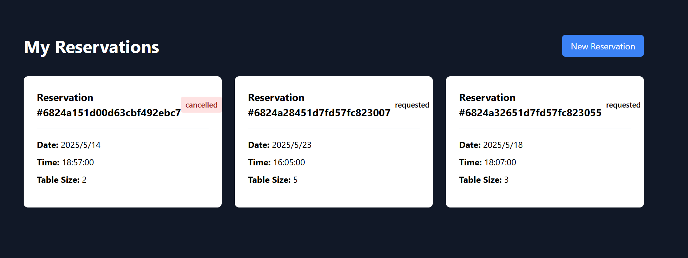
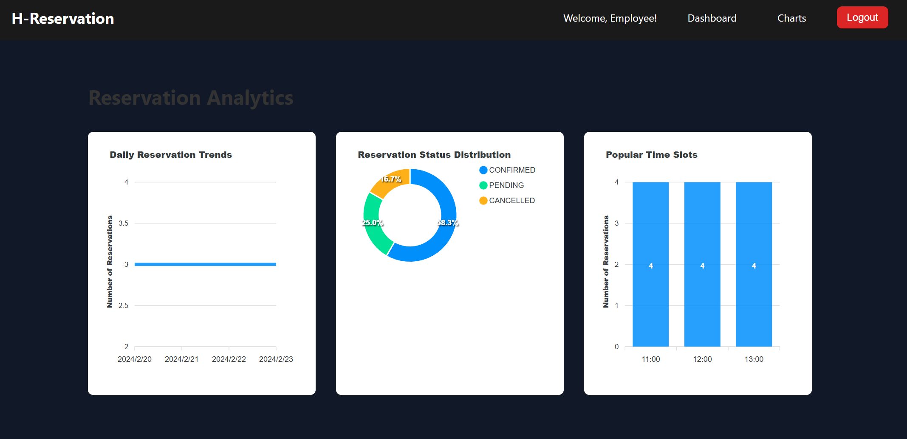

# H-Reservation

A modern restaurant reservation system built with SolidJS and ExpressJS.

## Features

- User authentication and authorization
- Employee dashboard with analytics
- Responsive design for all devices
- Modern and intuitive UI

## Tech Stack

- Frontend: SolidJS
- Database: MongoDB
- Authentication: JWT

## Project Structure

```
h-reservation/
├── apps/
│   ├── frontend/          # SolidJS frontend application
│   └── backend/           # NestJS backend application
├── packages/
│   └── shared/            # Shared types and utilities
└── docker-compose.yml     # Docker configuration
```

## Screenshots





## Getting Started

1. Clone the repository
2. Install dependencies:
   ```bash
   pnpm install
   ```
3. Start the development servers:
   ```bash
   pnpm dev
   ```
0. Create the Empoyee user
```bash
cd apps/backend && pnpx ts-node src/scripts/createEmployee.ts
```


## Development

- Frontend: `http://localhost:3000`
- Backend: `http://localhost:3001`


## Build
```bash
pnpm build
```